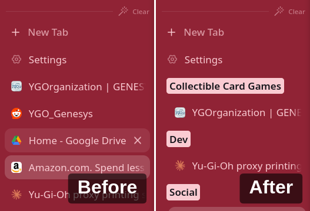
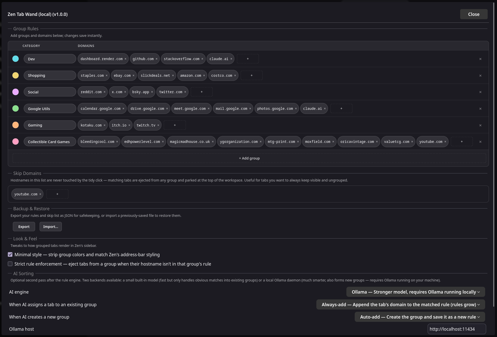
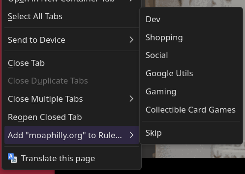
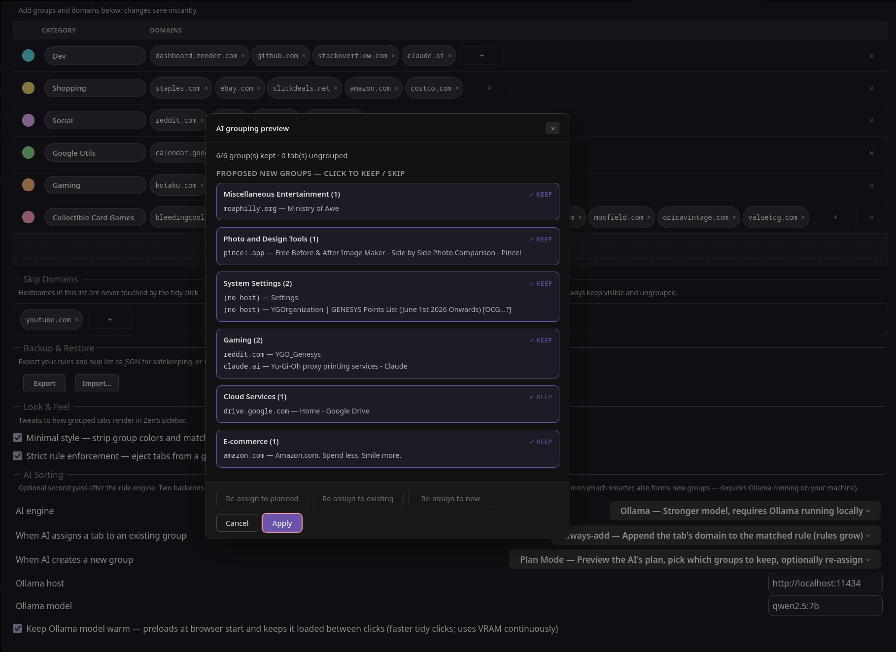

# Zen Tab Wand

A one-click tab tidier for [Zen Browser](https://zen-browser.app), installed via the [Sine](https://github.com/CosmoCreeper/Sine) mod loader. Click the wand in your toolbar, and your open tabs get sorted into groups.

<!-- SCREENSHOT — hero shot: a sidebar with messy unsorted tabs on the left, then the same sidebar with tabs neatly grouped after a wand click on the right. Place at `docs/images/hero-before-after.png` and uncomment the line below. -->
<!--  -->

## How it works

Two passes:

1. **Domain rules first.** You define groups in settings — e.g. `Shopping` matches `amazon.com`, `staples.com`, etc. Every open tab whose hostname matches a rule moves into the corresponding group.
2. **AI fallback for the rest.** Tabs the rules don't cover can be sent to a local AI engine that figures out where they belong. The AI is **optional and off by default**; you choose whether to enable it.

There's no cloud component. The AI runs on your machine via [Ollama](https://ollama.com) (recommended) or Firefox's bundled ML engine (limited).

## Installing

In Zen → Sine → Marketplace, search for "Zen Tab Wand" and install. Or sideload by dropping the source into your Sine mods folder.

After install, a wand icon appears in your toolbar's workspace separator. Right-click the icon to open settings.

<!-- SCREENSHOT — close-up of the wand button in the workspace separator, ideally with the cursor hovered to show the tooltip. Place at `docs/images/wand-button.png`. -->
<!--  -->

## Quick start

1. Open **Settings → Zen Tab Wand**.
2. Edit the **Group Rules** table to your liking. Each group needs a name, color, and one or more domains (e.g. `Dev` → `github.com, stackoverflow.com`).
3. Click the **wand button** in the toolbar. Your matching tabs are sorted instantly.
4. (Optional) Pick an **AI engine** for tabs the rules don't cover — see below.

<!-- SCREENSHOT — full settings panel showing Group Rules editor (with a few example rules and color swatches), Skip Domains row, Backup & Restore buttons, and the AI Sorting controls. Place at `docs/images/settings-panel.png`. -->
<!--  -->

## Growing rules from the tab right-click

Right-click any tab → **Add "host" to Rule…** — a submenu pops up listing every current rule. Pick one and the tab's hostname is appended to that rule's domain list. Rules already containing this hostname are listed with a ✓ and disabled. The bottom of the submenu also has a **Skip** entry that adds the hostname to the Skip Domains list.

The tab doesn't move — only the rule grows. Click the wand afterwards to actually sort tabs based on the new rule.

<!-- SCREENSHOT — the tab right-click menu open, with the "Add 'host' to Rule…" parent item hovered so the submenu is showing a few rules + the Skip entry at the bottom. Place at `docs/images/right-click-submenu.png`. -->
<!--  -->

## AI engines

| Engine | What it does | Setup |
|---|---|---|
| **Off** | Rules only. Tabs without a matching rule stay where they are. | — |
| **Local** | Firefox's bundled tab-embedding model. Only assigns tabs to *existing* groups; conservative by design, no new groups. No setup. | None — built in. |
| **Ollama** | A local Ollama daemon. Can both assign tabs into existing groups AND invent new ones, with a merge pass and an optional interactive **Plan Mode** modal where you preview the AI's plan before applying. | Install [Ollama](https://ollama.com), then `ollama pull qwen2.5:1.5b` (or a bigger model if you have the VRAM). |

For Ollama, the default model is `qwen2.5:1.5b` (~1 GB, runs on most GPUs). If you have 8+ GB VRAM, `qwen2.5:7b` is noticeably more accurate — change the model name in settings.

## Setting up Ollama

Ollama runs entirely on your machine — no API keys, no cloud, no per-token costs. Once it's installed and a model is pulled, this mod talks to it over `http://localhost:11434`.

**macOS**

1. Download Ollama for Mac from [ollama.com](https://ollama.com).
2. Open the downloaded `.dmg`, drag **Ollama** into Applications, and launch it. You'll see a small Ollama icon in the menu bar — that means the server is running.
3. Open Terminal and pull the default model:
   ```sh
   ollama pull qwen2.5:1.5b
   ```

**Windows**

1. Download the Windows installer from [ollama.com](https://ollama.com).
2. Run `OllamaSetup.exe`. Ollama installs as a background service and starts automatically (look for the icon in the system tray).
3. Open PowerShell or Command Prompt and pull the default model:
   ```powershell
   ollama pull qwen2.5:1.5b
   ```

**Linux**

1. One-liner install (the script handles all major distros):
   ```sh
   curl -fsSL https://ollama.com/install.sh | sh
   ```
2. The installer registers a systemd service and starts it. Confirm it's running:
   ```sh
   systemctl status ollama
   ```
3. Pull the default model:
   ```sh
   ollama pull qwen2.5:1.5b
   ```

**Finishing up (all platforms)**

1. In Zen → Settings → Zen Tab Wand → **AI Sorting**, set **AI engine** to `Ollama`.
2. The default **Ollama host** (`http://localhost:11434`) and **Ollama model** (`qwen2.5:1.5b`) should already match — change the model name if you pulled something different.
3. Click the wand. The first click after browser launch takes a few seconds while the model loads into VRAM; subsequent clicks are fast.

If you have questions about Ollama itself (other models, GPU compatibility, remote hosts, etc.) head to the [Ollama project site](https://ollama.com) and its [GitHub README](https://github.com/ollama/ollama).

## Modes when AI creates a new group

(Only relevant when the AI engine is set to Ollama.)

| Mode | What happens |
|---|---|
| **Auto-add** | AI creates the group AND saves a rule with the tabs' hostnames. Rules grow over time. Modal asks you to confirm. |
| **Transient** | AI creates the group, no rule saved. Fast, no confirmation. |
| **Prompt** | Opens Zen's edit modal for each new group so you can rename/recolor. |
| **Fresh categories** | AI re-tidies **all** tabs into fresh categories, ignoring your rules. Like Arc Browser's Tidy. |
| **Plan Mode** | Shows the proposed plan in a modal first. You toggle each group keep/skip, optionally click "Re-assign" to redo the unkept tabs, then Apply. |

<!-- SCREENSHOT — the Plan Mode modal mid-decision: proposed groups with their tab lists, one group toggled off (greyed), the Re-assign + Apply + Close buttons visible at the bottom. Place at `docs/images/plan-mode-modal.png`. -->
<!--  -->

## Other settings

- **Skip Domains** — a list of hostnames the wand should never touch. Tabs matching any pattern get ejected from any group and parked at the top of the workspace on every click. Useful for tabs you want to always keep visible and ungrouped.
- **Strict rule enforcement** — when on, tabs sitting inside a group whose rule doesn't list their hostname get ejected to the top on every wand click. Off by default.
- **Minimal style** — strips the colored backgrounds from groups for a flatter look.
- **Keep Ollama model warm** — preloads the model at browser startup and keeps it in VRAM between clicks. Faster, but uses VRAM continuously.

## Backup & Restore

Inside the settings panel under **Backup & Restore**:

- **Export** saves your rules + skip-domains as a JSON file in your default Downloads folder, named like `wand-backup-6groups-20260519-223045.json` (mod prefix + rule count + UTC timestamp). The file also appears in Firefox's downloads panel (`Ctrl+Shift+Y`).
- **Import…** replaces both lists from a JSON file you pick. Accepts either the current `{ "rules": […], "skipDomains": […] }` shape or a legacy bare rules array.

## Privacy

- Domain rules + their colors are saved in your Zen browser prefs. Local only.
- The Local AI runs entirely on-device using Firefox's bundled model.
- The Ollama engine talks to `localhost:11434` (or whatever host you configured). Nothing goes to the internet from this mod.
- The mod fetches `<meta name="description">` snippets from your open tab URLs (to give the AI better context). These fetches use your browser cookies and stay between your browser and the destination site — same as if you'd refreshed the tab.

## Reporting bugs

Open an issue on the source repository. Helpful to include the **Browser Console** log (Ctrl+Shift+J) around the time of the bug — the mod logs detailed diagnostics with the prefix `[ZenTabWand]`.

## License

MIT.
