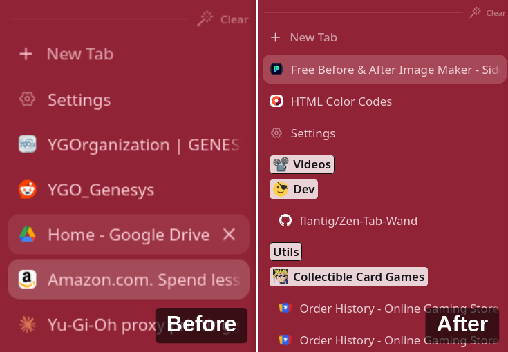
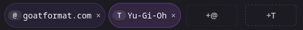
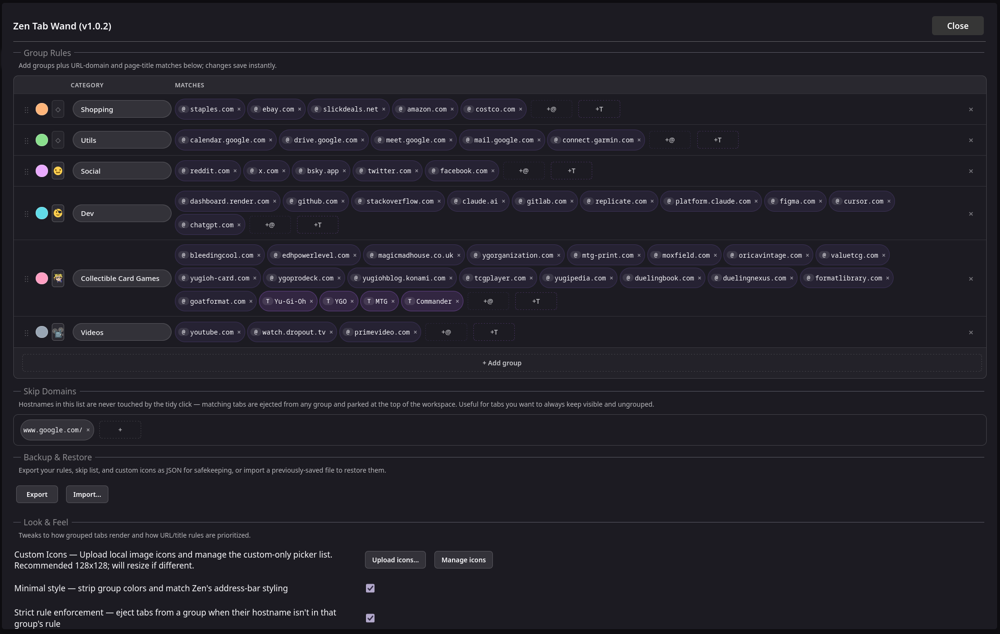
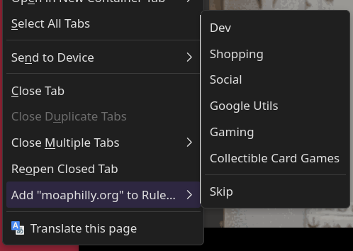
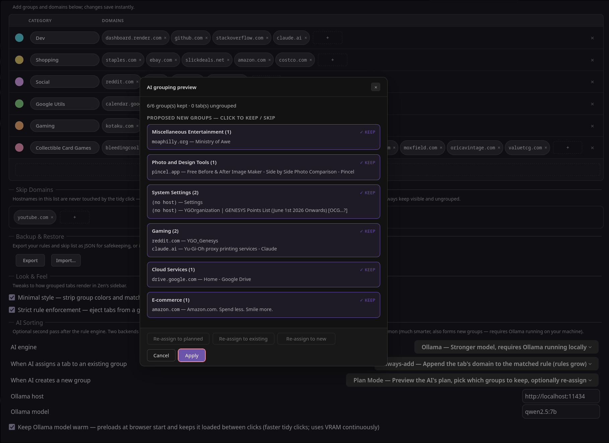
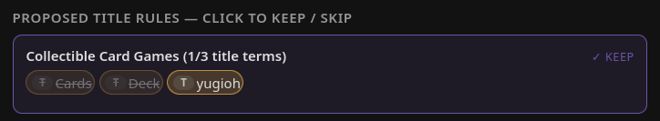
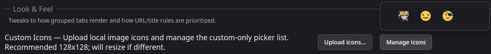

# OpenTabSort Zen

A one-click tab tidier for [Zen Browser](https://zen-browser.app), installed via the [Sine](https://github.com/CosmoCreeper/Sine) mod loader. Click the wand in your toolbar, and your open tabs get sorted into groups.



## Table of contents

- [How it works](#how-it-works)
- [Installing](#installing)
- [Quick start](#quick-start)
- [Growing rules from the tab right-click](#growing-rules-from-the-tab-right-click)
- [AI engines](#ai-engines)
- [Quick sorting with Jev](#quick-sorting-with-jev)
- [Setting up Ollama](#setting-up-ollama)
- [Choosing an AI model](#choosing-an-ai-model)
- [AI modes](#modes-when-ai-creates-a-new-group)
- [Other settings](#other-settings)
- [Backup & Restore](#backup--restore)
- [Privacy](#privacy)
- [Reporting bugs](#reporting-bugs)
- [License](#license)

## How it works

Two passes:

1. **Rules first.** You define groups in settings — e.g. `Shopping` matches domains like `amazon.com`, or title keywords like `invoice`. Every open tab whose URL/title matches a rule moves into the corresponding group.
2. **AI fallback for the rest.** Tabs the rules don't cover can be sent to a local AI engine that figures out where they belong. The AI is **optional and off by default**; you choose whether to enable it.

AI stays off unless you enable it. Choose Firefox Local AI, [Ollama](https://ollama.com), OpenAI-compatible, Gemini, or a custom endpoint. Remote providers require explicit consent before any tab context is fetched or sent.

**Version 1.4.0** adds live Jev sorting with optional LLM category suggestions. It incorporates upstream changes through September 20, 2026, while retaining the fork’s remote providers, bounded batches, and Full AI mode. Based on the MIT-licensed [Zen Tab Wand](https://github.com/flantig/Zen-Tab-Wand). See [CHANGELOG.md](CHANGELOG.md) for the actual changes.

### A practical workflow

If I have no groups and a lot of tabs, I'll run the ai model to create a good approximation of groups. Once I have a solid foundation to work from, I can turn the ai off and add individual domains to rules manually. I find this method to be the most efficient use of ai while being most practical and precise.

## Installing

In Zen → Sine, use **Install from GitHub** with `nggurbanov/OpenTabSort-Zen`. Restart Zen after installing or updating so cached modules reload. This fork uses its own mod identity; an upstream installation is separate.

After install, a wand icon appears in your toolbar's workspace separator. Left-click the icon to sort.


## Quick start

1. Open **Settings → OpenTabSort Zen**.
2. Edit the **Group Rules** table to your liking. Each group needs a name and one or more match chips: `@` chips for domains (e.g. `github.com`) and `T` chips for page-title keywords. Colors, gradients, and icons are optional.



3. Click the **wand button** in the toolbar. Your matching tabs are sorted instantly.
4. (Optional) Pick an **AI engine** for tabs the rules don't cover — see below.



Fresh installs start with a small set of editable default groups: Calendar, AI Tools, Dev, Shopping, Social, Music, and Search. Existing user rules are not overwritten when these defaults change.

## Growing rules from the tab right-click

Right-click any tab → **Add "host" to Rule…** — a submenu pops up listing every current rule. Pick one and the tab's hostname is appended to that rule's domain list. Rules already containing this hostname are listed with a ✓ and disabled. The bottom of the submenu also has a **Skip** entry that adds the hostname to the Skip Domains list.

The tab doesn't move — only the rule grows. Click the wand afterwards to actually sort tabs based on the new rule.



## AI engines

| Engine | What it does | Setup |
|---|---|---|
| **Off** | Rules only. Tabs without a matching rule stay where they are. | — |
| **Local** | Firefox's bundled tab-embedding model. Assigns tabs to existing groups and — as of v1.0.2 — can also invent new groups (Preview + Save Rule / Group Once / Fresh Rebuild). Names are derived from hostnames, intent labels, or extracted keywords. No setup. | None — built in. |
| **OpenAI-compatible** | Remote or self-hosted chat completions. | Set endpoint, model, API key, and consent. |
| **Gemini** | Google AI Studio generateContent. | Set model, API key, and consent. |
| **Custom** | OpenAI or Ollama-compatible service, including local servers without keys. | Set endpoint, model, format, optional key, and consent. |
| **Jev** | Classifies tabs into described categories in small parallel batches and organizes them live. An optional LLM suggests the categories first. | TypeSafe API key and consent; configure a suggestion provider or define categories yourself. |
| **Ollama** | A local Ollama daemon. Assigns tabs into existing groups and invents new ones, with a merge pass and an optional interactive **Preview Only** mode where you review the plan before applying. | Install [Ollama](https://ollama.com), then `ollama pull qwen2.5:1.5b` (or a bigger model if you have the VRAM). |

The first time you pick **Local** or **Ollama** in settings, a one-shot warning modal explains the resource cost (CPU/RAM for Local, VRAM for Ollama) and asks you to acknowledge before the engine is allowed to run.

Other AI engines fetch a small page-context snippet (`og:type`, `og:site_name`, first `<h1>`, `<meta name="description">`) for each unmatched tab to classify on more than just the URL. Jev uses compact tab metadata directly, without fetching pages.

## Quick sorting with Jev

Choose **Jev** in AI Sorting, enter your [TypeSafe API key](https://console.typesafe.ai/settings/keys), and enable data-sending consent. Under **Jev Quick Sort**, choose a category suggestion provider (OpenAI-compatible, Gemini, Custom, or Ollama) and fill in that provider's existing settings. Alternatively, define your categories yourself without configuring an LLM.

Click the wand. On first use, the LLM looks at the eligible tab list and proposes up to 10 categories with short names, scope descriptions, and examples. Jev then chooses a category for each tab, answering up to 30 tab questions in parallel per request. Batches shrink when needed to fit the request budget. Each completed batch applies immediately, with live progress and a brief highlight. Reduced-motion preferences disable highlights; the selected tab is processed last and is never highlighted or replaced by another selected tab.

**Automatic sorting is the default.** **Preview categories before sorting** is off. Enable it to rename, merge, remove, or adjust categories before classification. Cancelling the preview leaves categories and tabs unchanged and makes no Jev classification calls; the LLM suggestion call, if needed, has already happened.

| Category source | Behavior |
|---|---|
| **Reuse my categories** (default) | Suggests categories when this workspace has none, then reuses them on later sorts. |
| **Suggest from my tabs** | Refreshes the taxonomy from the current tab list on every sort. |
| **Define my own** | Uses only the named categories and descriptions saved in settings. |

Category meanings are saved separately for each workspace. Edit them in the Jev settings section; save an empty list to trigger suggestions on the next Reuse run. The suggestion pass normally covers hundreds of compact tabs in one request. Oversized lists are summarized in bounded chunks and their category proposals merged, so every eligible tab participates.

Jev regroups all eligible tabs, including already grouped tabs, by category meaning. It does not apply or grow domain/title rules. Pinned, essential, glance, placeholder, other-workspace, and Skip Domain tabs are excluded. Unknown, low-confidence, and invalid/missing answers keep their current membership. The confidence floor defaults to 0.5 and can be adjusted from 0 to 1.

**Stop** cancels the active request and keeps completed moves. **Undo sort** restores the previous group membership, tab order, group appearance, and collapsed state during the current session. Undo refuses to overwrite a layout edited afterwards. Workspace, tab, rule, or provider-setting changes during sorting stop further batches. Provider failures keep completed batches and leave remaining tabs untouched.

Jev and the category provider receive bounded titles, hostname/path context, and current group labels. URL credentials, query strings, and fragments are omitted, and Jev never fetches page snippets. TypeSafe receives your chosen category descriptions and examples as well. Keys remain in local preferences and are excluded from backups and diagnostics. The currently documented API is [`POST /v1/systemone`](https://docs.typesafe.ai/api); this integration defaults to `jev-latest`.

For Ollama, the default model is `qwen2.5:1.5b` (~1 GB, runs on most GPUs). If you have 8+ GB VRAM, `qwen2.5:7b` is noticeably more accurate — change the model name in settings.

## Setting up Ollama

Ollama runs entirely on your machine — no API keys, no cloud, no per-token costs. Once it's installed and a model is pulled, this mod talks to it over `http://localhost:11434`.

**macOS**

1. Download Ollama for Mac from [ollama.com](https://ollama.com).
2. Open the downloaded `.dmg`, drag **Ollama** into Applications, and launch it. You'll see a small Ollama icon in the menu bar — that means the server is running.
3. Open Terminal and pull the default model:
   ```sh
   ollama pull qwen2.5:1.5b
   ```

**Windows**

1. Download the Windows installer from [ollama.com](https://ollama.com).
2. Run `OllamaSetup.exe`. Ollama installs as a background service and starts automatically (look for the icon in the system tray).
3. Open PowerShell or Command Prompt and pull the default model:
   ```powershell
   ollama pull qwen2.5:1.5b
   ```

**Linux**

1. One-liner install (the script handles all major distros):
   ```sh
   curl -fsSL https://ollama.com/install.sh | sh
   ```
2. The installer registers a systemd service and starts it. Confirm it's running:
   ```sh
   systemctl status ollama
   ```
3. Pull the default model:
   ```sh
   ollama pull qwen2.5:1.5b
   ```

**Finishing up (all platforms)**

1. In Zen → Settings → OpenTabSort Zen → **AI Sorting**, set **AI engine** to `Ollama`.
2. The default **Ollama host** (`http://localhost:11434`) and **Ollama model** (`qwen2.5:1.5b`) should already match — change the model name if you pulled something different.
3. Click the wand. The first click after browser launch takes a few seconds while the model loads into VRAM; subsequent clicks are fast.

If you have questions about Ollama itself (other models, GPU compatibility, remote hosts, etc.) head to the [Ollama project site](https://ollama.com) and its [GitHub README](https://github.com/ollama/ollama).

## Choosing an AI model

The mod ships with two engines and lets you pick any model your Ollama install can run.

| Engine / model | Size on disk | What it can do | System impact |
|---|---|---|---|
| **Local** (`Mozilla/smart-tab-embedding`, built in) | ~100 MB | Assigns tabs to existing groups and can create simple hostname/intent-based groups. | Light, CPU only |
| `qwen2.5:0.5b` | ~400 MB | Basic clustering. Vague names. | Tiny, ~500 MB VRAM |
| `qwen2.5:1.5b` (default) | ~1 GB | Decent clustering, simple names. | Small, ~1.5 GB VRAM |
| `qwen2.5:3b` | ~2 GB | Better naming and category logic. | Medium, ~3 GB VRAM |
| `qwen2.5:7b` | ~5 GB | Strong naming and merging. Recommended. | Mid, ~6-8 GB VRAM |
| `qwen2.5:14b` | ~10 GB | Excellent on ambiguous tabs. | High, ~12 GB VRAM |
| `qwen2.5:32b` | ~22 GB | Best quality. Diminishing returns vs 14b. | Workstation, 24+ GB VRAM |

## Modes when AI creates a new group

Available for the Local, Ollama, and chat-provider engines. Jev has its own category controls described above. **Rules + AI** matches rules first and sends leftovers to AI; the legacy `hybrid` preference has the same behavior. **Full AI** analyzes all eligible tabs and never saves rules, regardless of the persistence settings below.

For those engines, plans are computed before any tab moves. Cancel leaves tab groups and rules unchanged. If you switch workspaces, edit rules, navigate, open/close tabs, or regroup while AI is running, the outdated plan is discarded. Tabs with failed or skipped classifications keep their original membership. Existing manual groups are preserved when AI creates new groups in Rules + AI mode. Jev applies completed batches live and supports Stop/Undo instead.

| Mode | What happens |
|---|---|
| **Preview + Save Rule** | AI shows a preview, then creates kept groups AND saves new rules with the tabs' hostnames. Rules grow only after approval. |
| **Group Once** | AI creates the group, no rule saved. Fast, no confirmation. |
| **Zen Edit Prompt** | Opens Zen's edit modal for each new group so you can rename/recolor. |
| **Fresh Rebuild** | Re-tidies **all** tabs into fresh categories, ignoring your rules. Like Arc Browser's Tidy. Local Fresh names clusters from a shared hostname (e.g. `Github & Gitlab`), an intent label (e.g. `Reading`), or extracted keywords (e.g. `Yu-Gi-Oh`) depending on the strongest signal in the cluster. Ollama Fresh runs a third-phase fuzzy-name dedupe that catches near-duplicates like `Content Unavailable` + `Content Unavailability`. |
| **Preview Only** | Shows the proposed plan in a modal first. You toggle each group keep/skip, optionally click "Re-assign" to redo the unkept tabs, then Apply. It applies groups but does not save new domain rules. |

## Modes when AI matches an existing group

| Mode | What happens |
|---|---|
| **Move + Save Domain** | Moves the tab into the matched group and adds its domain to that group's saved rule. |
| **Move Once** | Moves the tab now but does not update saved rules. The same tab may need AI again later. |



Ollama can also propose reviewed title chips (`T`) when **AI title learning** is set to **Review and Save (Simple)** or **Review and Save (Complex)**. Simple proposes chips from tab titles only; Complex can also fetch a small amount of page context and propose chips from that content. Proposed title chips appear in a separate title-rules section of the preview modal and are saved only when kept. Click a title chip to skip just that chip, or click the title-rule card to skip the whole proposal. Local Fresh Rebuild uses titles as transient clustering context but never saves title terms.



### Stickiness in Preview + Save Rule / Move + Save Domain

In **Preview + Save Rule** (new group) and **Move + Save Domain** (existing group) modes, tabs already sitting in a group you organized by hand won't be pulled out into a brand-new AI-invented group. They can still move into another *existing* group if the AI is confident. This keeps your manual organization from getting churned every time you click the wand.

## Other settings

- **Skip Domains** — a list of hostnames the wand should never touch. Tabs matching any pattern get ejected from any group and parked at the top of the workspace on every click. Useful for tabs you want to always keep visible and ungrouped. Grow the list from a tab right-click → **Add "host" to Rule…** → **Skip**.
- **Rule matching priority** — choose URL only, Title only, URL then Title, or Title then URL. The rule list is still first-match-wins within whichever source is being checked.
- **Custom Icons** — upload local image icons and manage the custom-only picker list. Recommended 128x128; uploaded icons are resized if different, stored locally, and can be assigned from the rule icon picker.

- **Strict rule enforcement** — when on, tabs sitting inside a group without any currently matching rule get ejected to the top on every wand click. It uses the active Rule matching priority, so title-only mode enforces title matches instead of domain matches. Off by default.
- **Gradient style** — choose how two-color group gradients are drawn. Left to right is the default.
- **Minimal style** — strips the colored backgrounds and gradients from groups for a flatter look. Rule icons stay visible.
- **Keep Ollama model warm** — preloads the model at browser startup and keeps it in VRAM between clicks. Faster, but uses VRAM continuously.
- **AI title learning** — Ollama-only. Simple proposes chips from tab titles; Complex can also propose chips from fetched page context. Reviewed title chips can be added to existing or new title-only rules during modal-confirmed rule growth.
- **Local AI batch size** — only used when there are more than 75 unmatched tabs. The Local engine switches into a chunked pipeline that deduplicates identical page inputs while keeping different pages on the same site separate and yields between batches so the browser stays responsive. Smaller batches = gentler on CPU, larger = faster. Above 500 unmatched tabs a confirmation modal appears before the AI pass runs.
- **Rule reordering** — drag the handle on the left of any row in the Group Rules table to reorder rules. Order determines match priority when a hostname appears in more than one rule.
- **Persistent collapsed groups** — collapsed/expanded state of every tab-group is saved and re-applied across browser restarts (Zen's own session save drops this).

## Right-click menus

- **On a tab** — `Add "host" to Rule…` opens a submenu listing every current rule plus a **Skip** entry. Rules already containing the hostname show a checkmark and are disabled.
- **On a tab-group header** — `Dissolve group` removes the group container and leaves its tabs in place at the top of the workspace. Useful when an AI-invented group missed the mark.

## Backup & Restore

Inside the settings panel under **Backup & Restore**:

- **Export** saves your rules, skip domains, and uploaded custom icons as a JSON file in your default Downloads folder, named like `wand-backup-6groups-20260519-223045.json` (mod prefix + rule count + UTC timestamp). The file also appears in Firefox's downloads panel (`Ctrl+Shift+Y`).
- **Import…** replaces the included lists from a JSON file you pick. Accepts either the current `{ "rules": […], "skipDomains": […], "customIcons": […] }` shape or a legacy bare rules array. If an imported rule references a missing custom icon, that rule's icon is cleared.

## Privacy

- Rules, colors, gradients, icons, and uploaded custom icon data are saved in your Zen browser prefs. Local only.
- The Local AI runs entirely on-device using Firefox's bundled model.
- The Ollama engine talks to `localhost:11434` (or whatever host you configured). A remote Ollama host receives the classification context you send to it.
- Remote services receive tab titles, hostname/URL context, and available page snippets after consent. API keys stay in browser preferences and are excluded from backups and diagnostics.
- The mod fetches `<meta name="description">` snippets from your open tab URLs (to give the AI better context). These fetches use your browser cookies and stay between your browser and the destination site — same as if you'd refreshed the tab.

## Development and verification

Run `npm run check` with Node 20 or newer. It validates the install manifest, preferences, privacy checks, provider boundaries, rule/preview logic, and tab identity tests. `npm run compare` checks the retained fork capabilities without requiring another checkout. For real browser checks, see [docs/e2e-zen.md](docs/e2e-zen.md).

## Reporting bugs

Open an issue on the source repository. Helpful to include the **Browser Console** log (Ctrl+Shift+J) around the time of the bug — the mod logs detailed diagnostics with the prefix `[OpenTabSort]`.

## License

MIT.
